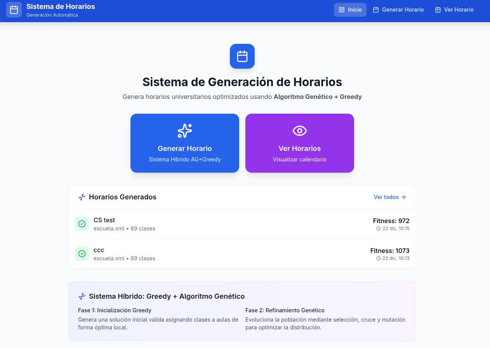
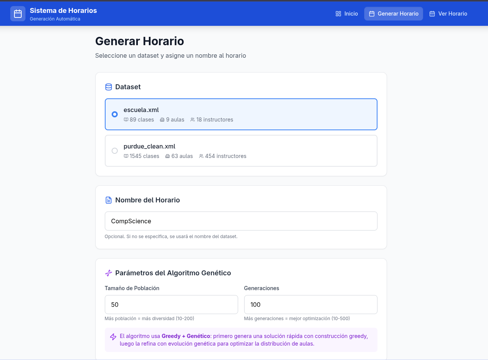
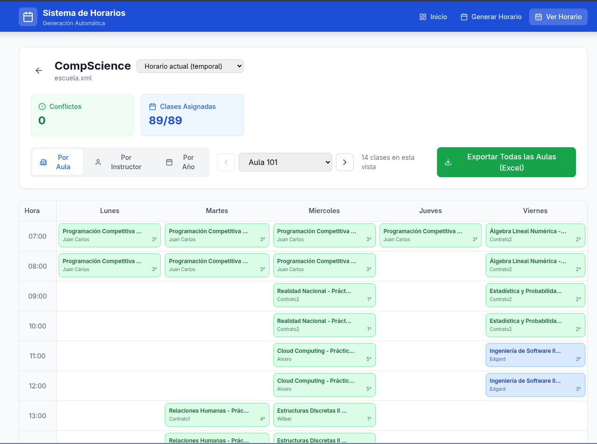
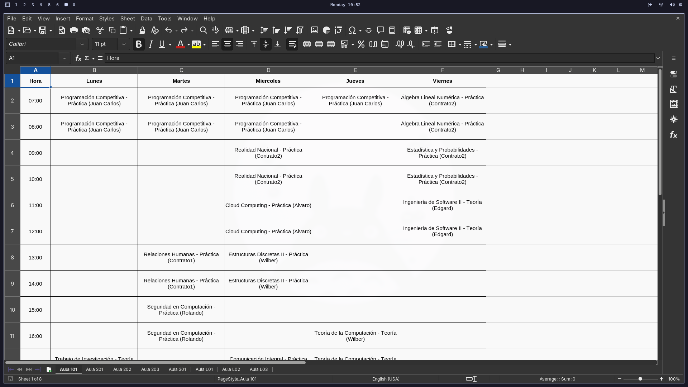

# Sistema de Generación de Horarios Universitarios

Sistema automatizado para generar horarios académicos optimizados utilizando un **sistema híbrido: Algoritmo Greedy + Algoritmo Genético**.

## Integrantes del Equipo

- **Christian Pardavé**
- **Leonardo Montoya**
- **Joselyn Quispe**

**Universidad Nacional de San Agustín de Arequipa**  
Escuela Profesional de Ciencia de la Computación

---

## Descripción del Sistema

Este sistema resuelve el problema de generación de horarios universitarios (University Course Timetabling Problem - UCTP), un problema NP-completo que consiste en asignar clases a aulas y franjas horarias respetando múltiples restricciones.

### Problema que Resuelve

- Asignación automática de clases a aulas disponibles
- Distribución equitativa del uso de aulas (evitar aulas vacías y sobrecargadas)
- Respeto de restricciones: capacidad, tipo de aula, límite de sesiones consecutivas
- Optimización del horario mediante evolución genética

---

## Arquitectura del Sistema

```
┌─────────────────────────────────────────────────────────────┐
│                     FRONTEND (React)                         │
│              TypeScript + TailwindCSS + Vite                 │
│  ┌────────────┬───────────────┬────────────────────┐        │
│  │ Dashboard  │   Schedules   │  ScheduleViewer    │        │
│  │ (inicio)   │  (generación) │  (visualización)   │        │
│  └────────────┴───────────────┴────────────────────┘        │
└──────────────────────────┬──────────────────────────────────┘
                           │ HTTP REST API (JSON)
┌──────────────────────────┴──────────────────────────────────┐
│                     BACKEND (Django)                         │
│              Django REST Framework + SQLite/PostgreSQL       │
│  ┌──────────────────────────────────────────────────────┐   │
│  │               generation_api.py                    │   │
│  │  ┌────────────────┐    ┌─────────────────────────┐   │   │
│  │  │ schedule_builder│ →  │ Algoritmo Genético     │   │   │
│  │  │   (GREEDY)     │    │ (Refinamiento)         │   │   │
│  │  └────────────────┘    └─────────────────────────┘   │   │
│  │                                                       │   │
│  │  ┌──────────────────────────────────────────────┐    │   │
│  │  │        Sistema de Restricciones              │    │   │
│  │  │  • Restricciones para Aulas (teóricas)       │    │   │
│  │  │  • Restricciones para Laboratorios           │    │   │
│  │  │  • Configuración General                     │    │   │
│  │  └──────────────────────────────────────────────┘    │   │
│  └──────────────────────────────────────────────────────┘   │
└──────────────────────────┬──────────────────────────────────┘
                           │ ORM Django
┌──────────────────────────┴──────────────────────────────────┐
│                    BASE DE DATOS                             │
│        SQLite (desarrollo) │ PostgreSQL (producción)        │
│  ┌─────────────────────────────────────────────────────┐    │
│  │ Schedule (schedule_data JSONField)                   │    │
│  │ Room, Instructor, Course, Class, TimeSlot, etc.     │    │
│  └─────────────────────────────────────────────────────┘    │
└──────────────────────────────────────────────────────────────┘
```

---

## Componentes Principales

### Backend (Django)

| Archivo | Responsabilidad |
|---------|-----------------|
| `generation_api.py` | API principal: algoritmo genético, sistema de restricciones, guardado en BD |
| `schedule_builder.py` | Algoritmo Greedy para solución inicial |
| `xml_parser.py` | Parser de archivos XML de entrada |
| `json_to_xml_converter.py` | Conversión de JSON a XML |
| `views.py` | ViewSets para CRUD de entidades base |
| `models.py` | Modelos ORM (Schedule, Room, Instructor, Course, Class, etc.) |
| `serializers.py` | Serializers DRF para entidades base |

### Frontend (React + TypeScript)

| Archivo | Responsabilidad |
|---------|-----------------|
| `Dashboard.tsx` | Página de inicio, estadísticas |
| `Schedules.tsx` | Generación y configuración de horarios |
| `ScheduleViewer.tsx` | Visualización en calendario interactivo |
| `api.ts` | Cliente HTTP con funciones tipadas |

---

## Sistema Híbrido: Greedy + Algoritmo Genético

### Fase 1: Inicialización Greedy (`schedule_builder.py`)

El algoritmo Greedy genera una **solución inicial válida** de forma rápida:

1. Carga datos del XML (aulas, instructores, clases, configuración)
2. Ordena clases por prioridad (tipo, año, duración)
3. Asigna cada clase a la mejor aula disponible que cumpla restricciones
4. Genera slots horarios respetando límites de sesiones consecutivas


### Fase 2: Refinamiento Genético (`generation_api.py`)

El Algoritmo Genético **refina la solución greedy** para optimizar la distribución de aulas:

1. **Población Inicial**: Crea variantes de la solución greedy mediante mutaciones
2. **Evaluación (Fitness)**: Mide calidad basada en restricciones configurables
3. **Selección por Torneo**: Elige los mejores individuos para reproducción
4. **Cruce**: Combina asignaciones de aulas de dos padres
5. **Mutación**: Cambia aulas priorizando las subutilizadas
6. **Elitismo**: Preserva los mejores individuos entre generaciones

---

## Sistema de Restricciones Configurables

Las restricciones son **independientes para aulas teóricas y laboratorios**, permitiendo reglas diferentes según el tipo de sala.

### Estructura de Restricciones

```json
{
    "aulas": {
        "max_hours_per_day": 8,
        "max_consecutive_blocks": 4,
        "preferred_start_block": 1,
        "preferred_end_block": 10,
        "avoid_blocks": [],
        "penalty_weights": {
            "room_conflict": 1000,
            "instructor_conflict": 1000,
            "capacity_overflow": 500,
            "preference_violation": 50,
            "consecutive_violation": 100
        }
    },
    "laboratorios": {
        "max_hours_per_day": 6,
        "max_consecutive_blocks": 3,
        "preferred_start_block": 1,
        "preferred_end_block": 8,
        "avoid_blocks": [],
        "penalty_weights": {
            "room_conflict": 1000,
            "instructor_conflict": 1000,
            "capacity_overflow": 800,
            "preference_violation": 100,
            "consecutive_violation": 150
        }
    },
    "general": {
        "min_gap_between_classes": 0,
        "balance_room_usage": true,
        "prefer_morning_classes": false
    }
}
```

### Descripción de Restricciones

| Restricción | Descripción |
|-------------|-------------|
| `max_hours_per_day` | Máximo de horas por día en un aula |
| `max_consecutive_blocks` | Máximo de bloques consecutivos |
| `preferred_start_block` | Bloque preferido para iniciar clases |
| `preferred_end_block` | Bloque preferido para terminar clases |
| `avoid_blocks` | Bloques a evitar (ej: almuerzo) |
| `penalty_weights` | Pesos de penalización para el fitness |

---

## Endpoints de la API

### Generación de Horarios

| Método | Endpoint | Descripción |
|--------|----------|-------------|
| GET | `/api/generate/datasets/` | Lista datasets disponibles |
| POST | `/api/generate/schedule/` | Genera horario con parámetros |
| GET | `/api/generate/last/` | Obtiene último horario generado |
| GET | `/api/generate/saved/` | Lista horarios guardados en BD |
| GET | `/api/generate/saved/<id>/` | Obtiene horario por ID |
| DELETE | `/api/generate/saved/<id>/delete/` | Elimina horario |
| GET | `/api/generate/constraints/` | Obtiene restricciones configurables |

### Ejemplo de Generación

```json
POST /api/generate/schedule/
{
    "dataset": "escuela.xml",
    "name": "Horario Semestre 2025-I",
    "population_size": 50,
    "generations": 100,
    "constraints": {
        "laboratorios": {
            "max_hours_per_day": 5,
            "max_consecutive_blocks": 2
        }
    }
}
```

**Respuesta**:
```json
{
    "success": true,
    "schedule": {
        "id": 1,
        "name": "Horario Semestre 2025-I",
        "fitness_score": 1150.5,
        "conflict_count": 0,
        "classes_assigned": 89,
        "generation_time_ms": 2500,
        "algorithm": "greedy+genetic",
        "assignments": [...]
    }
}
```

---

## Base de Datos

### Desarrollo (SQLite)

Por defecto, el sistema usa SQLite para desarrollo local:

```bash
backend/db.sqlite3
```

### Producción (PostgreSQL)

Para usar PostgreSQL, configura la variable de entorno:

```bash
# Variables de entorno requeridas
export USE_POSTGRESQL=true
export DB_NAME=horarios
export DB_USER=postgres
export DB_PASSWORD=tu_password
export DB_HOST=localhost
export DB_PORT=5432
```

### Modelo de Schedule

Los horarios se guardan en la tabla `schedule_app_schedule`:

```python
class Schedule(models.Model):
    name = models.CharField(max_length=255)
    schedule_data = models.JSONField(default=dict)  # Horario completo
    fitness_score = models.FloatField(default=0)
    conflict_count = models.IntegerField(default=0)
    status = models.CharField(max_length=50, default='draft')
    created_at = models.DateTimeField(auto_now_add=True)
```

---

## Instalación y Ejecución

### Requisitos

- Python 3.10+
- Node.js 18+
- npm o yarn

### Backend (Django)

```bash
# Crear entorno virtual
cd backend
python -m venv ../env
..\env\Scripts\activate  # Windows
source ../env/bin/activate  # Linux/Mac

# Instalar dependencias
pip install -r requirements.txt

# Migraciones
python manage.py migrate

# Ejecutar servidor
python manage.py runserver 8000
```

### Frontend (React)

```bash
cd frontend
npm install
npm run dev
```

### Acceder al Sistema

- **Frontend**: http://localhost:5173
- **Backend API**: http://localhost:8000/api/

---

## Datasets Incluidos

| Dataset | Clases | Aulas | Instructores |
|---------|--------|-------|--------------|
| escuela.xml | 89 | 9 | 18 |
| purdue_clean.xml | 1545 | 63 | 454 |
| datos_horarios_pequeno.xml | 10 | 4 | 3 |


---

### Capturas de Pantalla

- **Vista principal**  
    

- **Generación de horario**  
    

- **Vista de horario**  
    

- **Exportación a Excel**  
    

---
