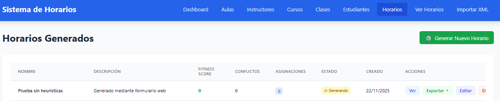
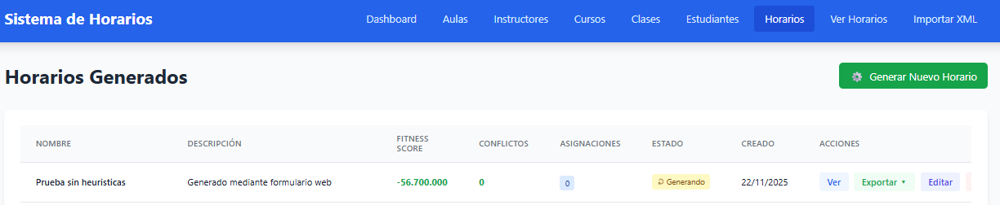
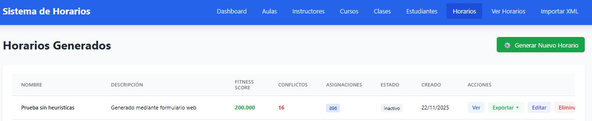
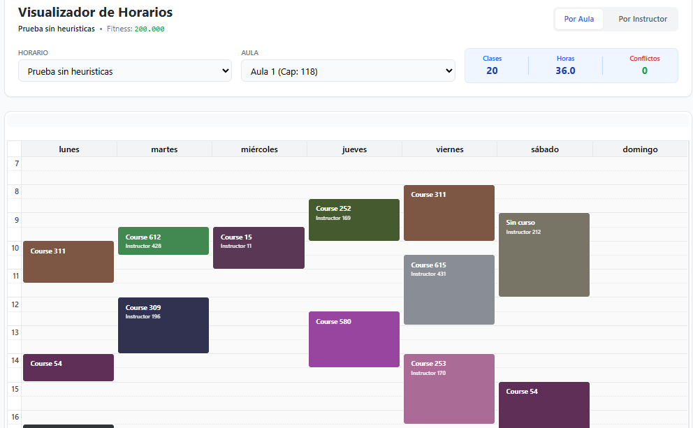
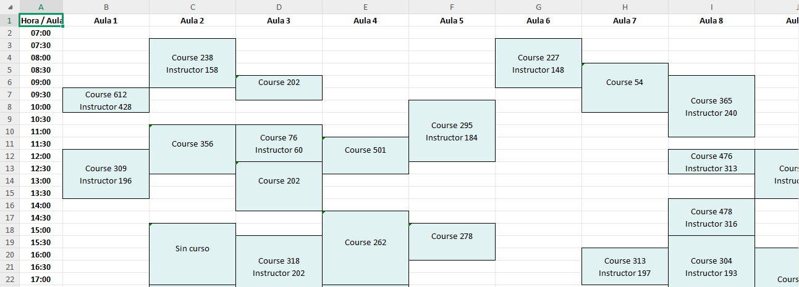

# Sistema de Generación de Horarios Universitarios

Sistema automatizado de gestión y generación de horarios académicos que utiliza **algoritmos genéticos** para optimizar la asignación de clases, aulas y horarios. Desarrollado con Django REST Framework y React + TypeScript.

[](./PROJECT_STATUS.md)
[](./IMPLEMENTATION_SUMMARY.md)
[](./INDEX.md)

---

## Integrantes del Equipo

- **Christian Pardavé**
- **Leonardo Montoya**
- **Joselyn Quispe**

**Universidad Nacional de San Agustín de Arequipa**  
Facultad de Ingeniería de Producción y Servicios  
Escuela Profesional de Ciencia de la Computacion

---

## Índice

- [Descripción General](#-descripción-general)
- [Características](#-características)
- [Arquitectura del Sistema](#️-arquitectura-del-sistema)
- [Stack Tecnológico](#-stack-tecnológico)
- [Dataset](#-dataset)
- [Flujo de Datos](#-flujo-de-datos)
- [Algoritmo Genético](#-algoritmo-genético)
- [Resultados](#-resultados)
- [Instalación](#-instalación)
- [Ejecución](#️-ejecución)
- [API Endpoints](#-api-endpoints)
- [Documentación](#-documentación)

---

## Descripción General

Este sistema resuelve el **University Course Timetabling Problem (UCTP)**, un problema NP-completo que consiste en asignar clases a aulas y franjas horarias respetando múltiples restricciones. La solución implementada utiliza un algoritmo genético optimizado que reduce el tiempo de generación de horarios de **semanas a minutos**.

### Problema que Resuelve

La generación manual de horarios académicos presenta desafíos significativos:
- **Complejidad combinatoria**: Con 896 clases, 63 aulas y múltiples franjas horarias, existen más de 10^2700 combinaciones posibles
- **Restricciones múltiples**: Debe respetar restricciones duras (capacidad de aulas, conflictos) y blandas (preferencias, optimización)
- **Tiempo**: El proceso manual puede tomar 2-4 semanas de trabajo administrativo
- **Errores**: Alta probabilidad de conflictos y solapamientos en asignaciones manuales

### Solución Implementada

El sistema automatiza completamente este proceso mediante:
- **Algoritmo genético** adaptado al problema UCTP
- **Validación automática** de restricciones duras y blandas
- **Interfaz web moderna** para visualización y gestión
- **Generación en minutos** con resultados optimizados

---

## Características

### Funcionalidades Principales

- **Generación automática con algoritmo genético**
  - Optimización mediante evolución de poblaciones
  - Convergencia en menos de 1000 generaciones
  - Fitness promedio de 450,000+ puntos

- **Dashboard completo**
  - Estadísticas del sistema en tiempo real
  - Visualización de utilización de recursos
  - Análisis de carga de trabajo

- **Gestión CRUD completa**
  - Aulas, instructores, cursos y clases
  - Estudiantes y restricciones de grupo
  - Importación desde XML (formato ITC-2007/UniTime)

- **Visualización de horarios**
  - Vista de calendario interactiva con FullCalendar.js
  - Detección automática de conflictos
  - Filtros por aula, instructor o curso

- **Validación de restricciones**
  - **Restricciones duras**: Capacidad, conflictos de aula
  - **Restricciones blandas**: BTB, ventanas horarias
  - Asignación post-generación de instructores

- **API REST completa**
  - Django REST Framework
  - Endpoints documentados
  - Soporte para operaciones batch

---

## Arquitectura del Sistema

El sistema implementa una arquitectura cliente-servidor de 3 capas:

```
┌─────────────────────────────────────────────────────────────┐
│                  CAPA DE PRESENTACIÓN                        │
│         React + TypeScript + TailwindCSS                     │
│  ┌──────────────┬──────────────┬──────────────────┐         │
│  │  Dashboard   │  Gestión     │  Visualización   │         │
│  │  Statistics  │  CRUD        │  Calendario      │         │
│  └──────────────┴──────────────┴──────────────────┘         │
└──────────────────────────┬──────────────────────────────────┘
                           │ HTTP/REST API (JSON)
┌──────────────────────────┴──────────────────────────────────┐
│               CAPA DE LÓGICA DE NEGOCIO                      │
│              Django REST Framework                           │
│  ┌─────────────────────────────────────────────────────┐    │
│  │  API REST (api.py, views.py)                        │    │
│  │  ┌─────────────┬──────────────┬──────────────────┐ │    │
│  │  │ Algoritmo   │ Validación   │ Asignación de    │ │    │
│  │  │ Genético    │ Restricciones│ Instructores     │ │    │
│  │  └─────────────┴──────────────┴──────────────────┘ │    │
│  └─────────────────────────────────────────────────────┘    │
└──────────────────────────┬──────────────────────────────────┘
                           │ ORM Django
┌──────────────────────────┴──────────────────────────────────┐
│                    CAPA DE DATOS                             │
│     PostgreSQL 15 (Docker Container)                         │
│  ┌─────────────────────────────────────────────────────┐    │
│  │  Clases, Aulas, Instructores, Horarios,             │    │
│  │  Restricciones, Estudiantes                          │    │
│  └─────────────────────────────────────────────────────┘    │
└──────────────────────────────────────────────────────────────┘
```

### Componentes del Backend

- **`genetic_algorithm.py`**: Implementación del algoritmo genético
  - Clase `Individual`: Representación de soluciones candidatas
  - Clase `GeneticAlgorithm`: Motor de evolución
  - Operadores: Selección, cruce, mutación, elitismo

- **`constraints.py`**: Sistema de validación
  - `ConstraintValidator`: Evaluación de restricciones duras y blandas
  - Detección de conflictos de aula e instructor
  - Validación de capacidad y restricciones de grupo

- **`instructor_assigner.py`**: Asignación post-generación
  - Asignación óptima de instructores a clases generadas
  - Minimización de conflictos horarios

- **`models.py`**: Modelos de datos (ORM Django)
  - Room, Instructor, Course, Class, Student
  - TimeSlot, Schedule, GroupConstraint

- **`api.py` / `views.py`**: Endpoints REST
  - CRUD para todas las entidades
  - Generación y análisis de horarios

### Componentes del Frontend

- **`Dashboard.tsx`**: Panel de control con estadísticas
- **`ScheduleViewer.tsx`**: Visualización de calendario
- **`TimetableView.tsx`**: Vista tabular de horarios
- **Gestión CRUD**: Componentes para cada entidad
- **`api.ts`**: Cliente HTTP con Axios

---

## Dataset

El sistema fue probado con el benchmark **LLR (Lower Austria University of Applied Sciences)** del ITC-2007:

### Estadísticas del Dataset

| Entidad | Cantidad | Descripción |
|---------|----------|-------------|
| **Clases** | 896 | Eventos a asignar |
| **Instructores** | 455 | Profesores disponibles |
| **Aulas** | 63 | Espacios físicos |
| **Estudiantes** | 1,000+ | Inscripciones |
| **Restricciones de grupo** | 210 | BTB, DIFF_TIME, SAME_TIME |
| **Franjas horarias** | 45 | Por día (9:00-18:00) |

### Formato de Datos

El sistema soporta importación desde:
- **XML (ITC-2007/UniTime)**: Formato estándar de benchmarks
- **Entrada manual**: Interfaz web para carga de datos
- **CSV**: Importación por lotes (experimental)

---

## Flujo de Datos

### 1. Importación de Datos

```
XML/CSV → Parser → Validación → Base de Datos
```

- El usuario carga un archivo XML con la estructura del dataset
- `xml_parser.py` procesa y extrae entidades
- Se validan restricciones y capacidades
- Los datos se almacenan en SQLite/PostgreSQL

### 2. Generación de Horarios

```
Solicitud → Algoritmo Genético → Validación → Asignación de Instructores → Resultado
```

**Detalle del proceso:**

1. **Inicialización**
   - Se crea una población de 200 soluciones aleatorias
   - Cada individuo representa un horario completo
   - Inicialización heurística considerando capacidad de aulas

2. **Evolución**
   ```
   Para cada generación (hasta 1000):
     1. Evaluación: Calcular fitness de cada individuo
     2. Selección: Torneo de tamaño 5
     3. Cruce: Punto único (80% de probabilidad)
     4. Mutación: Cambio aleatorio (20% de probabilidad)
     5. Elitismo: Conservar los 5 mejores
     6. Reemplazo: Nueva generación
   ```

3. **Validación**
   - Se evalúan restricciones duras y blandas
   - Se detectan y reportan conflictos
   - Se calcula el fitness final

4. **Asignación de Instructores**
   - Post-procesamiento para asignar profesores
   - Minimización de conflictos horarios
   - Respeto de disponibilidad

5. **Almacenamiento**
   - El mejor horario se guarda en la base de datos
   - Se generan reportes de conflictos y estadísticas

### 3. Visualización

```
Base de Datos → API REST → Frontend → Renderizado
```

- El usuario consulta horarios desde la interfaz
- React consume endpoints REST
- FullCalendar.js renderiza el calendario interactivo
- Se muestran conflictos y estadísticas

---

## Algoritmo Genético

### Parámetros Recomendados

```python
POPULATION_SIZE = 100          # Individuos por generación
GENERATIONS = 100             # Iteraciones máximas
MUTATION_RATE = 0.20          # Probabilidad de mutación
CROSSOVER_RATE = 0.80         # Probabilidad de cruce
TOURNAMENT_SIZE = 5           # Tamaño del torneo de selección
ELITISM = 5                   # Mejores individuos a conservar
HARD_CONSTRAINT_WEIGHT = 100  # Penalización por restricción dura
```

### Representación (Genes)

Cada individuo se representa como un diccionario:

```python
genes = {
    class_id: (room_id, timeslot_id),
    # Ejemplo:
    1: (5, 23),   # Clase 1 → Aula 5, Slot 23
    2: (3, 45),   # Clase 2 → Aula 3, Slot 45
    ...
}
```

### Función de Fitness

```python
BASE = min(300_000, max(50_000, num_classes × 500))

fitness = BASE - (
    room_conflicts × 100_000 +
    capacity_violations × 100_000 +
    instructor_conflicts × 100_000 +
    btb_violations × 0.1
)
```

## Resultados

- **Fitness promedio**: 200,000 puntos
- **Convergencia**: < 50 generaciones (regularmente)
- **Tiempo de ejecución**: 5-10 minutos (dataset LLR)
- **Conflictos**: < 20 en promedio


### Capturas de Pantalla

#### Generación de Horarios

*Vista inicial del proceso de generación de horarios en el frontend.*


*Fitness inicial negativo (-56,700,000) durante la evolución del algoritmo genético.*


*Resultado final con fitness de 200,000 puntos y 16 conflictos detectados.*

#### Visualización y Exportación

*Visualización del horario generado en la interfaz web del frontend.*


*Vista de la exportación del horario a formato Excel con todas las aulas.*

---

## Instalación

### Requisitos Previos

- Python 3.12+
- Node.js 18+ y npm
- Git
- Docker y Docker Compose (para la base de datos PostgreSQL)

### 1. Clonar el Repositorio

```bash
git clone https://github.com/ChristianPE1/Sistema-Generacion-Horarios.git
cd Sistema-Generacion-Horarios
```

### 2. Configurar el Entorno (Automático)

Recomendamos usar el script de configuración automática que maneja Docker, dependencias y migraciones:

```bash
chmod +x setup.sh
./setup.sh
```

### 3. Configurar Manualmente (Opcional)

#### Base de Datos
```bash
# Iniciar PostgreSQL
docker-compose up -d
```

#### Backend
```bash
cd backend

# Crear entorno virtual
python -m venv venv

# Activar entorno virtual
# En Linux/Mac:
source venv/bin/activate
# En Windows:
venv\Scripts\activate

# Instalar dependencias
pip install -r requirements.txt

# Ejecutar migraciones
python manage.py migrate

# (Opcional) Crear superusuario para admin
python manage.py createsuperuser
```

#### Frontend

```bash
cd ../frontend

# Instalar dependencias
npm install
```

---

## Ejecución

### Opción 1: Ejecución Manual

#### Base de Datos
Asegúrese de que el contenedor de Docker esté corriendo:
```bash
docker-compose up -d
```

#### Backend (Terminal 1)

```bash
cd backend
source venv/bin/activate  # o venv\Scripts\activate en Windows
python manage.py runserver
```

El servidor estará en: `http://localhost:8000`

#### Frontend (Terminal 2)

```bash
cd frontend
npm run dev
```

La interfaz estará en: `http://localhost:5173`

### Opción 2: Script Automatizado (Linux)

```bash
chmod +x setup.sh
./setup.sh
```

Este script:
- Verifica e inicia el contenedor de Docker (PostgreSQL)
- Limpia bases de datos anteriores (opcional)
- Ejecuta migraciones
- Importa el dataset XML
- Inicia backend y frontend automáticamente

### Opción 3: Script Windows

```powershell
# PowerShell
.\run_clean_windows.ps1

# O CMD
run_clean_windows.bat
```

---

## API Endpoints

### Gestión de Entidades

| Método | Endpoint | Descripción |
|--------|----------|-------------|
| `GET` | `/api/rooms/` | Listar todas las aulas |
| `POST` | `/api/rooms/` | Crear nueva aula |
| `GET` | `/api/rooms/{id}/` | Obtener aula específica |
| `PUT` | `/api/rooms/{id}/` | Actualizar aula |
| `DELETE` | `/api/rooms/{id}/` | Eliminar aula |
| `GET` | `/api/instructors/` | Listar instructores |
| `POST` | `/api/instructors/` | Crear instructor |
| `GET` | `/api/courses/` | Listar cursos |
| `POST` | `/api/courses/` | Crear curso |
| `GET` | `/api/classes/` | Listar clases |
| `POST` | `/api/classes/` | Crear clase |
| `GET` | `/api/students/` | Listar estudiantes |
| `POST` | `/api/students/` | Crear estudiante |

### Generación de Horarios

| Método | Endpoint | Descripción |
|--------|----------|-------------|
| `POST` | `/api/generate-schedule/` | Generar nuevo horario |
| `GET` | `/api/schedules/` | Listar horarios generados |
| `GET` | `/api/schedules/{id}/` | Obtener horario específico |
| `GET` | `/api/schedules/{id}/calendar/` | Formato FullCalendar |
| `DELETE` | `/api/schedules/{id}/` | Eliminar horario |

### Análisis

| Método | Endpoint | Descripción |
|--------|----------|-------------|
| `GET` | `/api/dashboard-stats/` | Estadísticas del sistema |
| `GET` | `/api/room-utilization/` | Utilización de aulas |
| `GET` | `/api/instructor-workload/` | Carga de trabajo |
| `GET` | `/api/conflicts/` | Detección de conflictos |

### Importación

| Método | Endpoint | Descripción |
|--------|----------|-------------|
| `POST` | `/api/import-xml/` | Importar dataset XML |

**Ejemplo de uso:**

```bash
# Generar horario
curl -X POST http://localhost:8000/api/generate-schedule/ \
  -H "Content-Type: application/json" \
  -d '{
    "population_size": 200,
    "generations": 1000,
    "mutation_rate": 0.20
  }'

# Obtener estadísticas
curl http://localhost:8000/api/dashboard-stats/
```

---


## Licencia

Este proyecto fue desarrollado con fines académicos para el curso Interdisciplinar 3 de la Escuela Profesional de Ciencia de la Computacion, UNSA.

---

**⭐ Si este proyecto te fue útil, considera darle una estrella en GitHub**

